# WhyLabs documentation

This repository contains WhyLabs's documentation.

This website is built using [Docusaurus 2](https://v2.docusaurus.io/), a modern static website generator.

To contribute, please follow these steps:

[[_TOC_]]

## Requirements

- Git CLI
- [Node.js](https://nodejs.org/en/download/) version >= 12.13.0 or above (which can be checked by running `node -v`).
  You can use [nvm](https://github.com/nvm-sh/nvm) for managing multiple Node versions on a single machine installed
- [Yarn](https://yarnpkg.com/en/) version >= 1.5 (which can be checked by running `yarn --version`). Yarn is a
  performant package manager for JavaScript and replaces the `npm` client.

## Clone and branching

```
git clone git@gitlab.com:whylabs/public/whylabs-docs.git
cd whylabs-docs
yarn install
git checkout -b docs-your-edit
```

## Make your edits

* Please make your local edits
  
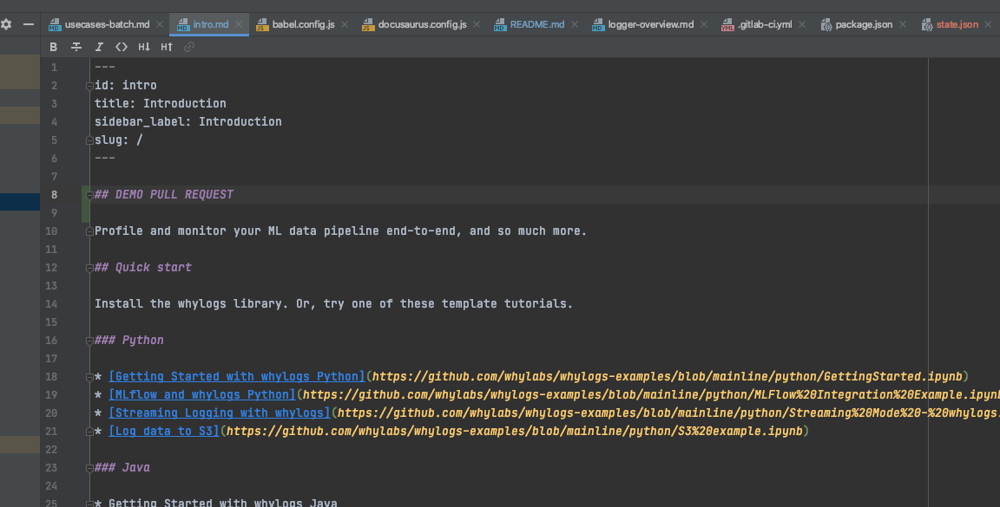

* You can test the local version with:

```
yarn start
```

This command starts a local development server and open up a browser window. Most changes are reflected live without
having to restart the server.

## Build

* Docusaurus will fail if there are broken links in the documentation (even though it will run the preview fine)
* To test the Docusaurus build, run

```console
yarn build
```


## Git-based Workflows

* Useful if you want to preview content locally and make styling changes

* You'll need to commit your local branch first using Git

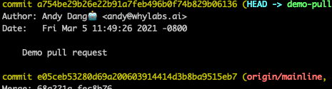

* You'll need to push the branch back to GitLab to create a pull request

```console
git push --set-upstream original <your-branch-name>
```

* GitLab will then prompt you with a link to create the pull request
  
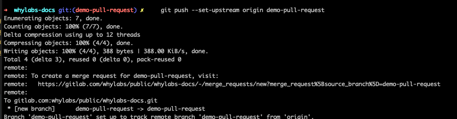

* Then you can fill out the information for the pull request. You should select yourself as "Assignee" and add appropriate reviewers.
You can add multiple reviewers:
  
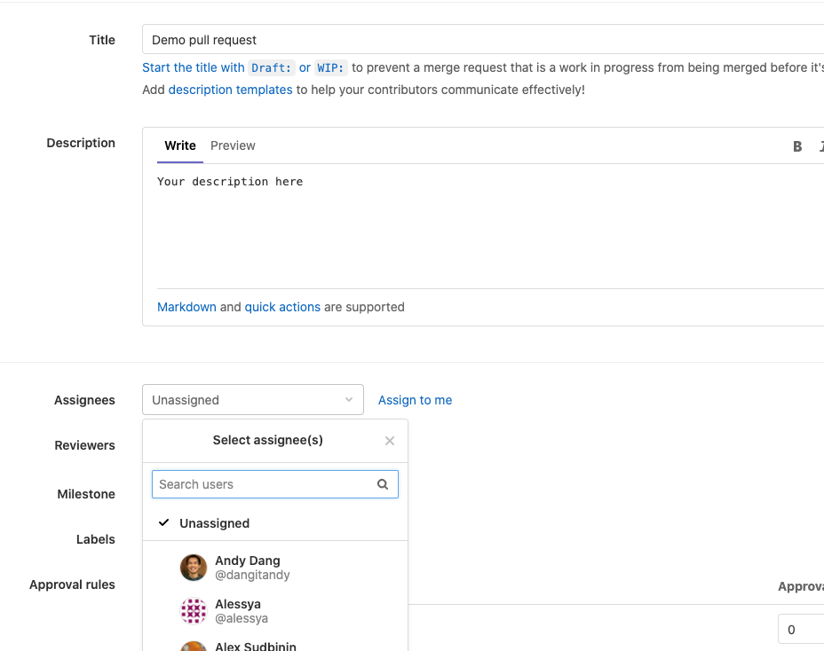

* Once you create a merge request, you should see it in
  GitLab: [merge requests](https://gitlab.com/whylabs/public/whylabs-docs/-/merge_requests)

### Verify the merge request
* Once submitted, GitLab will kick off a build preview. You can see it in the merge request page:

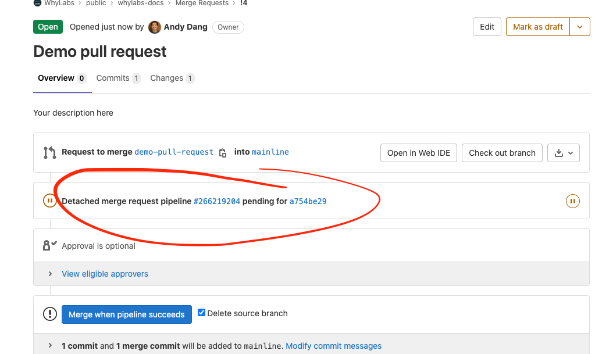
  
* If everything goes well, the preview step will succeed. You can view the preview log by clicking on the link:

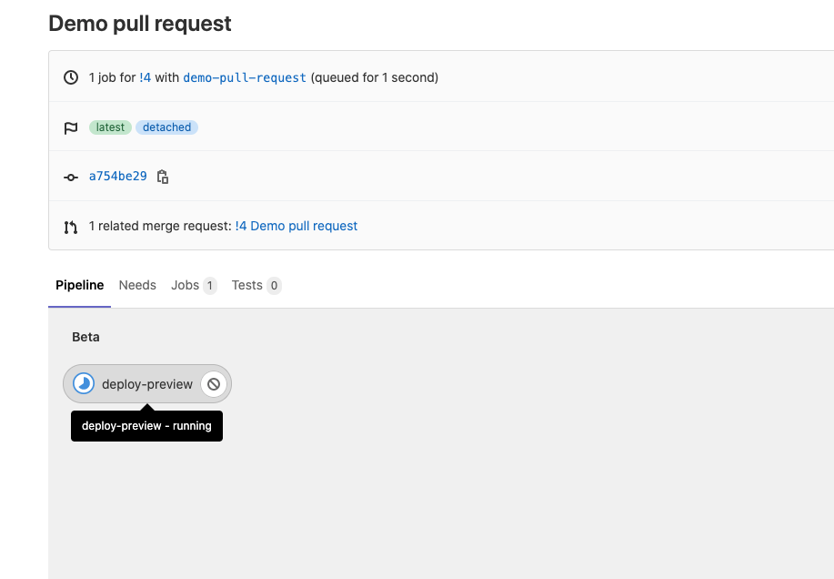

* Once passed, you can click on the link to get the **preview website**

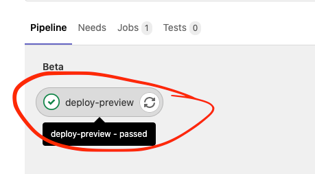

* At the bottom of the preview log, you should see a website link like this:

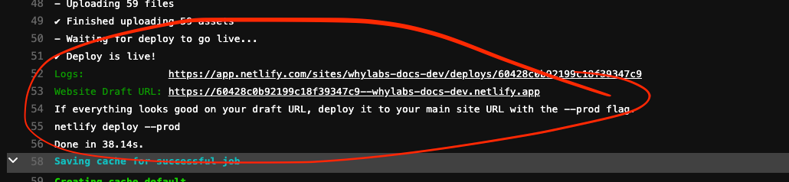

* You can visit the website to check out the doc. Make sure you append `/_docs` to the preview link. Your link should look 
like this:
  
```
https://<unique-id>-whylabs-docs-dev.netlify.app/docs
```

* As a reviewer, you should do your due diligence as well by following these steps!

### Deployment

* Once merged, the changes will flow through the [pipeline](https://gitlab.com/whylabs/public/whylabs-docs/-/pipelines).
* You should see a merge pipeline like this with three steps (build, beta, prod)

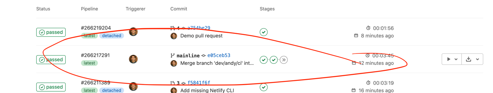

* Please check out the beta preview link before deploying to Prod: https://whylabs-docs-dev.netlify.app/docs

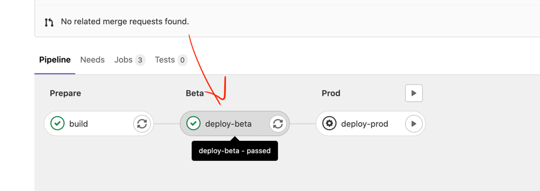

* Clicking on "Passed" button should take you to the detailed pipeline. If you have the right permission, you should see the
"Play" button next to `deploy-prod`. Using this you can deploy the final version to production

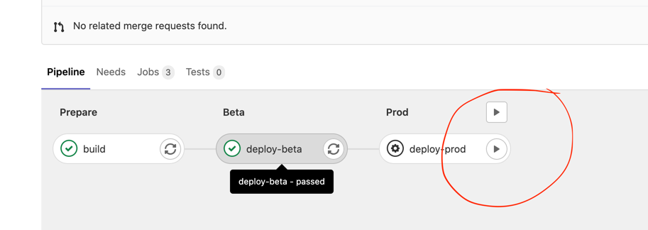
  
## Browser-based Workflow

[TBD]
* Navigate to the [docs](https://gitlab.com/whylabs/public/whylabs-docs/-/tree/mainline/docs) directory in GitLab
* Follow GitLab Web IDE instructions to make changes
* Preview should appear whne you create a merge request